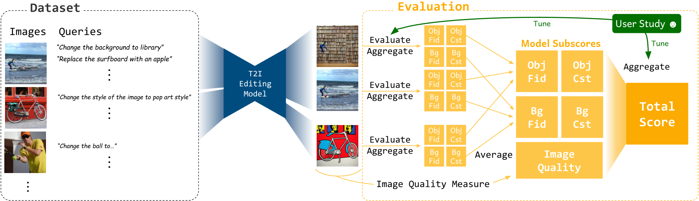

# HATIE: Towards Scalable Human-aligned Benchmark for Text-guided Image Editing

[Suho Ryu](https://scholar.google.com/citations?user=fQCeEH0AAAAJ&hl)\,
Kihyun Kim\,
Eugene Baek\,
Dongsoo Shin\,
[Joonseok Lee](https://viplab.snu.ac.kr/)\
CVPR '25 Highlight |
[GitHub](https://github.com/SuhoRyu/HATIE) | [arXiv](https://arxiv.org/abs/2505.00502)

(Codes and datasets will be released soon)

 
